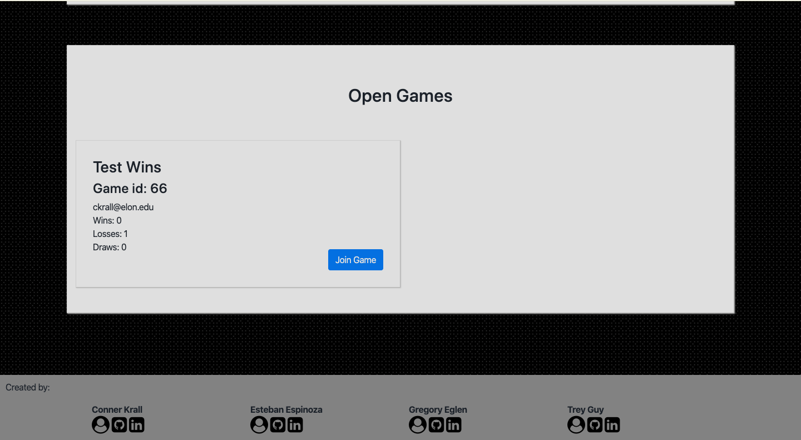
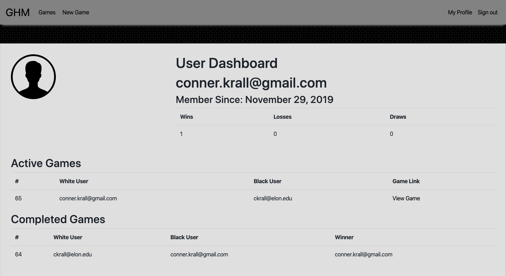

# Ruby on Rails Chess

This was a chess app designed to teach each member in the group how to effectively work on an Agile Project. Users sign up to play other people on the internet. Users have a dedicated user dashboard to show wins/losses/draws and highlight active games as well as completed games.

Rspec was used for operations testing. It was built using Ruby on Rails. User authentication was enabled by Devise as well as OmniAuth. PostgreSQL was used for database management. Bootstrap was used for design. Javascript and jQuery were used for gameplay drag/drop. Travis CI was used for continuous integration.

Users must be signed in to join games.

## Click [here](https://ruby-on-rails-chess.herokuapp.com/) to view.

This is the Home page:

This is the Games page where you can see your active games and join unmatched games:

This is the Gameplay page where you play your game:

This is the user dashboard where you can view your record, active games, and completed games:

## Tools & Resources

* [Ruby on Rails](https://rubyonrails.org/) 
* [PostgreSQL](https://www.postgresql.org/)
* [Bootstrap](https://getbootstrap.com/)
* [Devise](https://github.com/plataformatec/devise/)
* [RSpec](https://github.com/rspec/rspec-rails/)
* [jQuery: draggable](https://jqueryui.com/draggable/)
* [jQuery: droppable](https://jqueryui.com/droppable/)